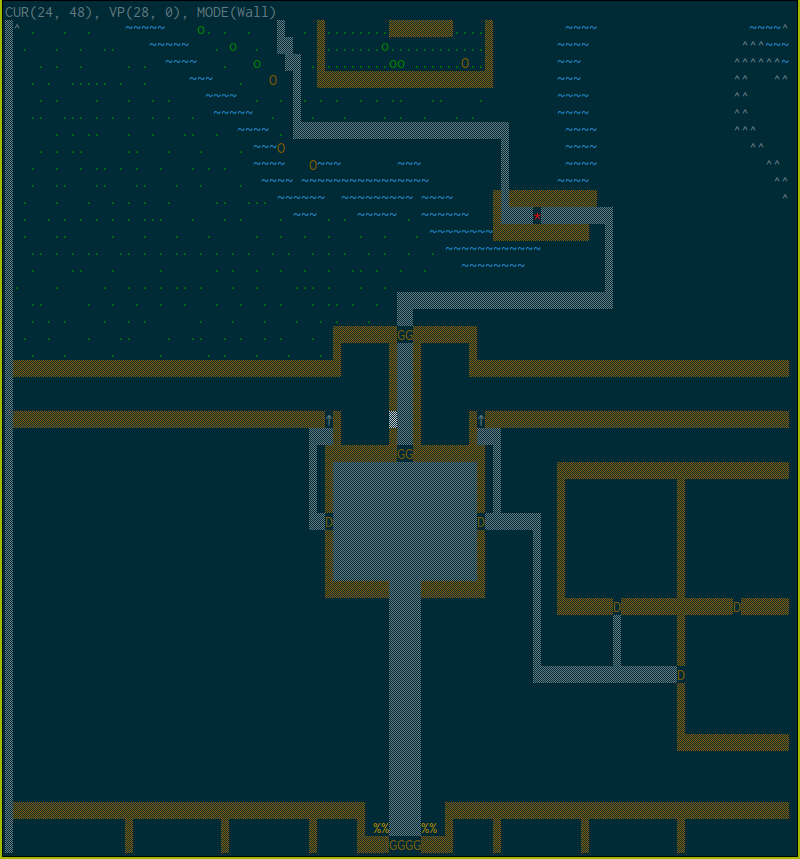
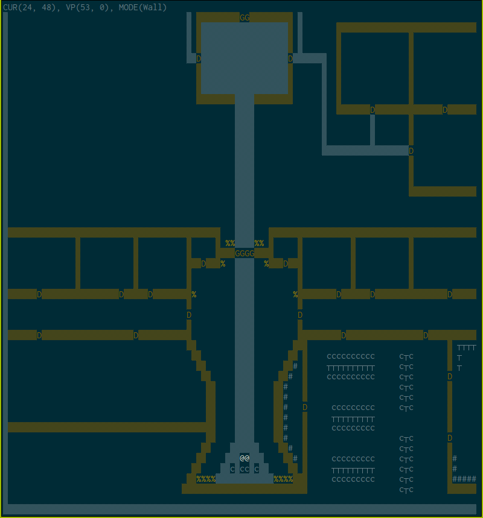
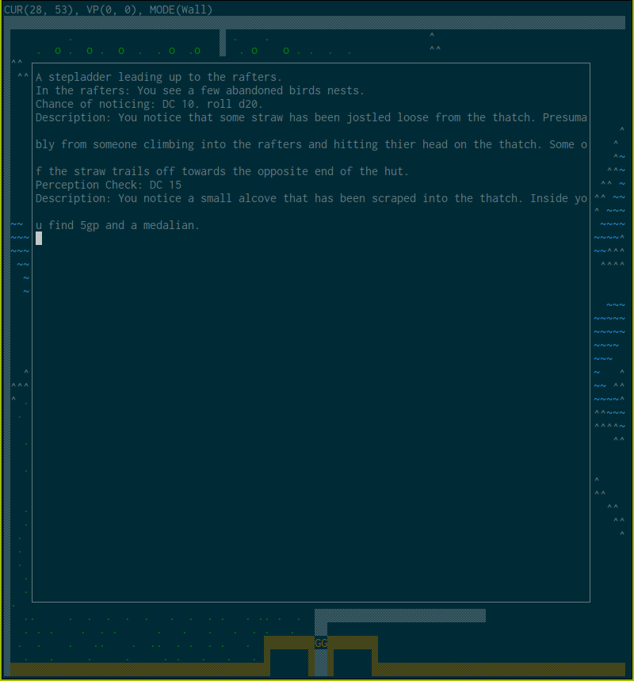

## Dungeon Builder

A simple map with a wall with a gate, a road, a river, two buildings with chests, lanterns, tables, chairs, and up and down stair cases.

A bridge across a rivier, a castle wall with a court yard and a barracks next door.

Castle entrance with throne room and great hall.

Example of a feature annotation
