# Cursed
A tool for designing and playing DnD style games via a terminal using the curses library. Supports one Game Master(GM) and multiple Player Characters(PCs). GMs have the power to edit the map and story of the campaign all in one lightweight tool. PCs can then connect to the server to play. The GM has the ability to add and remove Fog of War to obsucre the vision of PCs, add objects to the map and view/edit the campaign narrative all on one screen. 

*Disclaimer:* Running cursed in a tmux or gnu screen session, or any other screen, screen-256color, etc. term is NOT supported. To my knowledge, we cannot define colors in these terms, meaning color definitions are defined by the terminal color bindings. Running cursed in one of these environments may result in unexpected color behavior, and may in some cases render the program unusable (black screen, invisible characters, etc).


## Screenshots and Features: 
### A castle with a couple of huts out front.
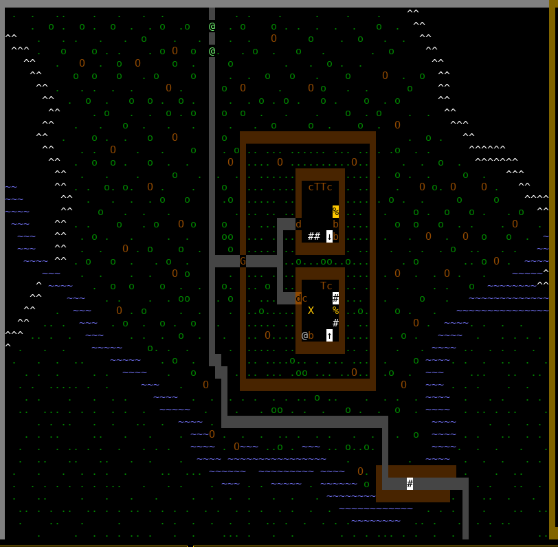


### Editing Notes
Objects with notes are indicated to the GM by flashing. The GM can add/edit the notes attatched to any object. The editor that is used is determined by the ```EDITOR``` environment variable. If ```EDITOR``` is not set, it defaults to ```vim```.

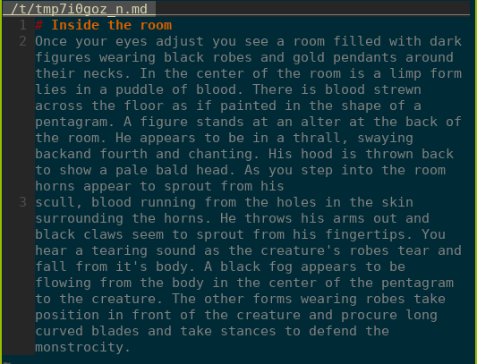


### Narrative
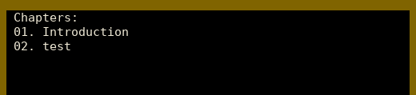
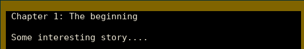


### Chat 
To show the chat window, while on the main command window, press ```c```. To send a message type ```:send <message>``` or ```:s <message>```. To whisper to another player, type ```:whisper <player username> <message>``` or ```:w <player username> <message>``` for short.

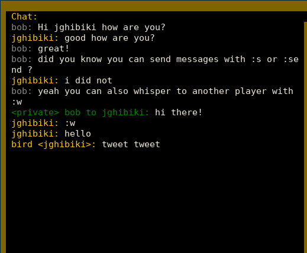


### Fog of War
To toggle FoW from the main command window press ```f```. To edit the FoW press ```F``` to enter the FoW editing menu. ```a``` will add fog to a space, ```r``` will remove fog from a space. As with all commands, they can be used with motions: e.g. ```20 a l``` to add 20 blocks of fog to the right of the initial cursor position.

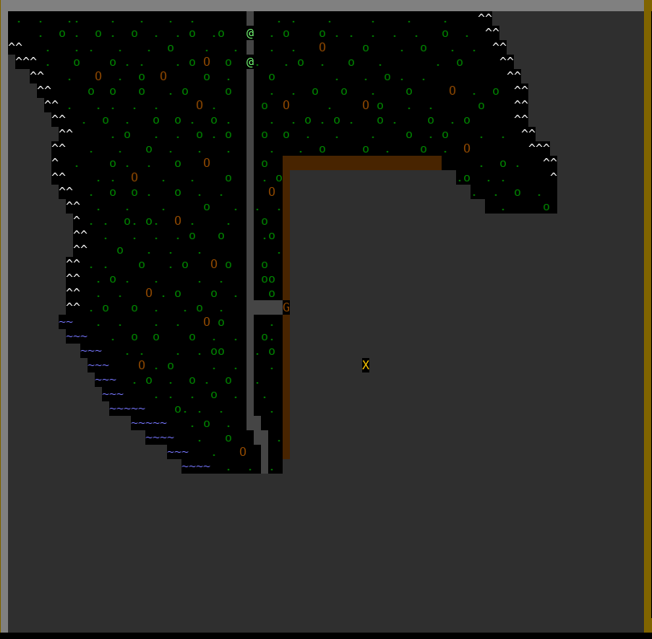

### Editing Map
The editor can be configured with custom map feature types, custom characters for displaying features, and defining custom colors.
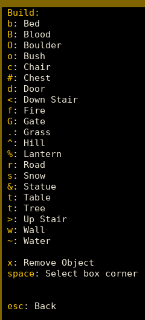

The editor also supports block selecting so that instead of manually placing an entire building, you can bulk add features to a square region and then bulk remove the inside to hollow out the space, all using the block select tool.
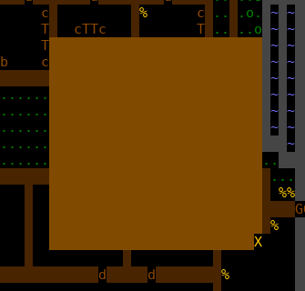

### Units

  Units are almost the most important aspect of a DnD or other RPG campeign. Cursed allows you to easily create, place, and edit basic unit info. Units are displayed as @ symbols of varying colors.

  Units in Cursed fall into one of three categories: PC, Enemy, or Neutral.
PC: short for Player Character - is as its name describes, controlled by a player character and are by default displayed as green to everyone. When the DM makes a PC, it's controller field must be set to the username of the player who will be able to control it. If the controller field is not set, Cursed assumes that the DM should be the only one to control the unit. PCs can check to see if they have control of a unit by simply checking it's color. If a unit shows up as blue to a player, then they have control of the unit.

Enemy: Denotes that a unit is an aknowledged enemy of the party, and that approaching the unit will probably aggrivate it into attack. Enemy units are represented as red.

Neutral: Denotes that a unit is not an enemy, and not a pc, players may approach the unit at their discretion, however the GM desides if and when to edit the unit config to make it an enemy. Maybe that will teach the players not to kill the farmers chickens... Neutral units are colored grey.

  When a user moves their cursor over a unit, the unit name and current health are shown in the status bar! Keep in mind that units in Cursed are like slightly fancier tokens in on a board, the token itself doesn't store any info about the unit (except health to be convinient).
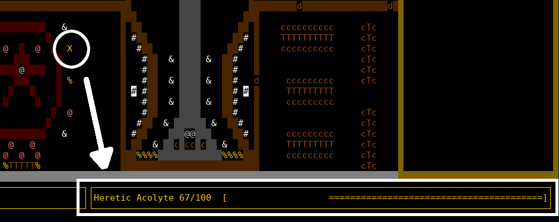

Units are configured using a very simple JSON based file, when you wish to create a new unit, Cursed will launch the default terminal ```$EDITOR``` and will display something similar to the following (although it will be blank for a new unit). Note that the terminal colors for the editor will be based on your terminal color settings, so you probably won't have such an ugly red in your editor.
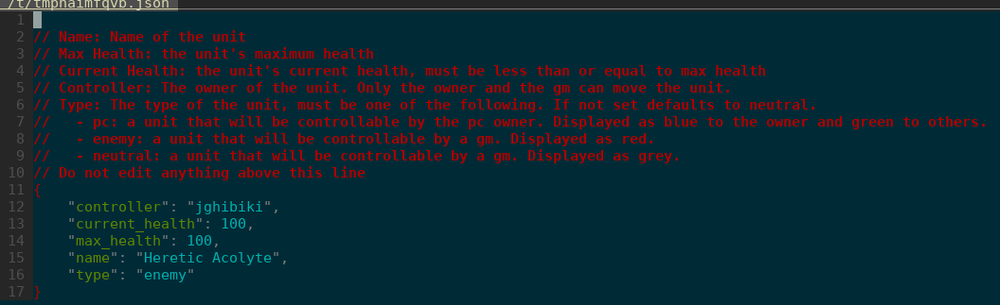


### Rolling Dice
To roll dice type ```:roll <number of rolls>d<number of sides on die>``` or ```:r <number of rolls>d<number of sides on die>```. Use ```ctrl+j``` to scroll down and ```ctrl+k``` to scroll the results up and down.

### Clients: Curses (Terminal) and Javascript (Browser) Comparison
Note: Both clients are a WIP, however the curses client is much more fully featured at the moment.

Curses Client
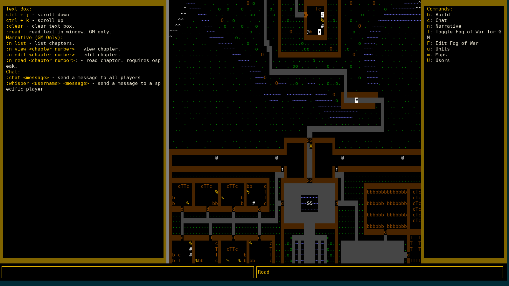

Web Client
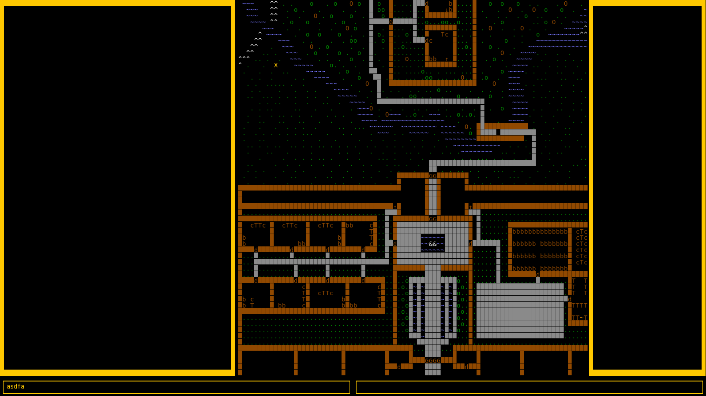


