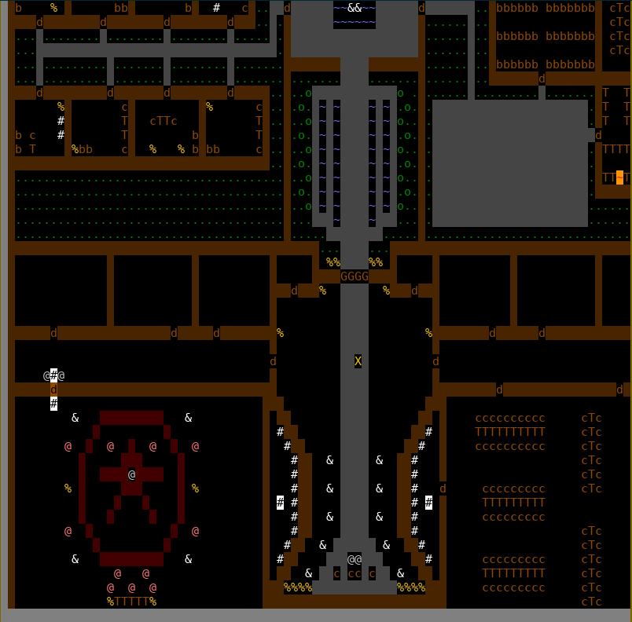

# Cursed
A tool for designing and playing DnD style games via a terminal using the curses library. Supports one Game Master(GM) and multiple Player Characters(PCs). GMs have the power to edit the map and story of the campaign all in one lightweight tool. PCs can then connect to the server to play. The GM has the ability to add and remove Fog of War to obsucre the vision of PCs, add objects to the map and view/edit the campaign narrative all on one screen. 

*Disclaimer:* Running cursed in a tmux or gnu screen session, or any other screen, screen-256color, etc. term is NOT supported. To my knowledge, we cannot define colors in these terms, meaning color definitions are defined by the terminal color bindings. Running cursed in one of these environments may result in unexpected color behavior, and may in some cases render the program unusable (black screen, invisible characters, etc).


## Screenshots and Features: 
### A castle with a couple of huts out front.



### Editing Notes
Objects with notes are indicated to the GM by flashing. The GM can add/edit the notes attatched to any object. The editor that is used is determined by the ```EDITOR``` environment variable. If ```EDITOR``` is not set, it defaults to ```vim```.


### Narrative


### Chat 
To show the chat window, while on the main command window, press ```c```. To send a message type ```:send <message>``` or ```:s <message>```. To whisper to another player, type ```:whisper <player username> <message>``` or ```:w <player username> <message>``` for short.


### Fog of War
To toggle FoW from the main command window press ```f```. To edit the FoW press ```F``` to enter the FoW editing menu. ```a``` will add fog to a space, ```r``` will remove fog from a space. As with all commands, they can be used with motions: e.g. ````20 a l``` to add 20 blocks of fog to the right of the initial cursor position.


### Editing Map


### Units


### Rolling Dice
To roll dice type ```:roll <number of rolls>d<number of sides on die>``` or ```:r <number of rolls>d<number of sides on die>```. Use ```ctrl+j``` to scroll down and ```ctrl+k``` to scroll the results up and down.

### Clients: Curses (Terminal) and Javascript (Browser) Comparison
Note: Both clients are a WIP, however the curses client is much more fully featured at the moment.

Curses Client


Web Client


